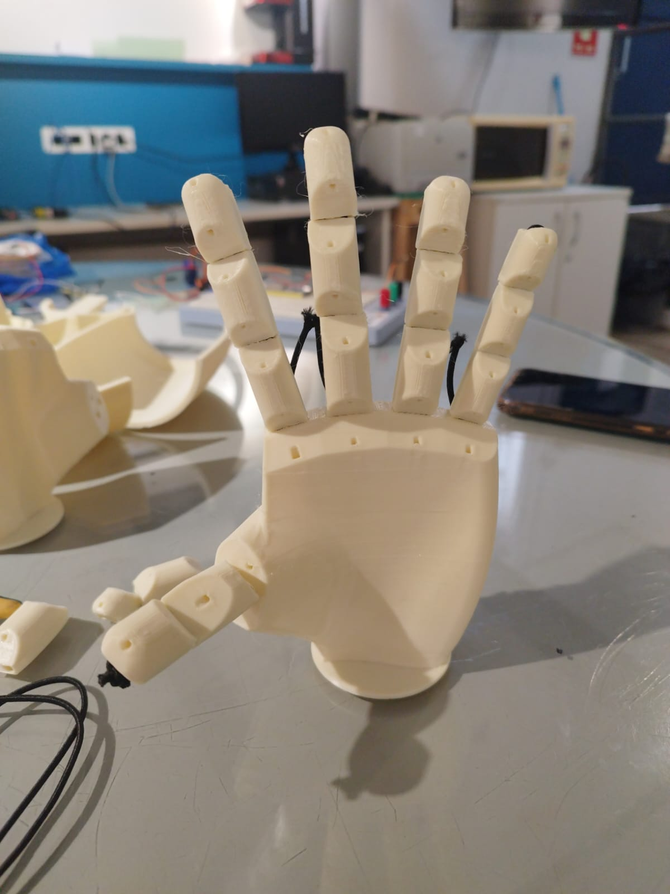
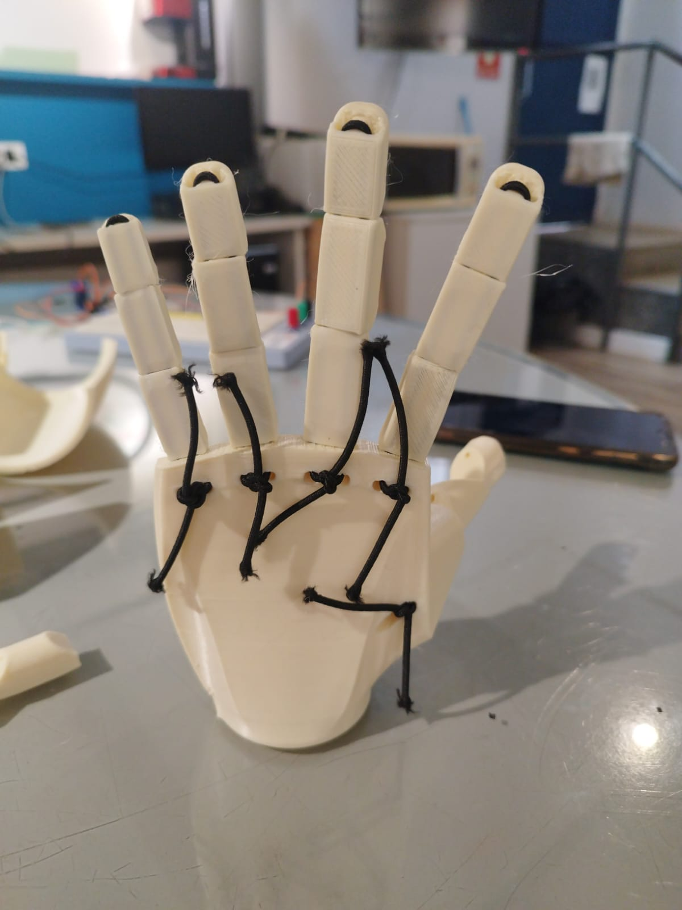

  <a href="#english">🇺🇸 English</a> | 
  <a href="#portugues">🇧🇷 Português</a>

---

# Robotic Hand - Prototype Project

**Federal University of Uberlândia - UFU**

**Course/Subject: Procedural Programming**

---
## About the Project

This project consists of the development and control of a **robotic hand** driven by servo motors. The goal is to simulate human finger movements through commands programmed or sent via serial interface.

---

## 👥 Group Members

* **Ana Luísa Cardoso de Matos** - ID: `12521EBI036`
* **Ana Júlia Freitas Resende** - ID: `12521EBI006`
* **Camila Franco Borges** - ID: `12521EBI026`
* **Larissa Araújo Lima** - ID: `12511EBI008`
* **Vinícius Santos Nímia** - ID: `12521EBI022`

---

## 🛠️ Components Used

| Component | Quantity | Description |
| :--- | :---: | :--- |
| **Microcontroller** | 1 | ESP32-Wrover |
| **Servo Motors** | 1 | *TAL* servos for finger control |
| **Power Supply** | 1 | 5V external power supply |
| **3D Structure** | 1 | PLA/ABS printed hand |
| **Wires / Jumper Wires** | - | Signal and power connections |

---

## 📸 Gallery and Mechanism of Action

Below are images of the 3D printed robotic hand (based on the *InMoov* open-source project), highlighting the mechanical cable/tendon actuation system.

| Palmar View (Front) | Dorsal View (Back) |
| :---: | :---: |
|  |  |

### 🔍 Mechanical Explanation

1. **Tendon Actuation (Nylon Wires/Cords):**
   * The hand uses an **artificial tendon** system (black wires guided by internal channels printed inside the phalanges).
   * **Flexion (Closing fingers):** Each finger has a cable running along the palmar side. When pulled by a servo motor at the base/forearm, the wire tightens and bends the finger joints.
   * **Extension (Opening fingers / Return):** As seen in the dorsal view, elastic/lock cords are anchored to the back of the hand. They provide the necessary retraction tension for the finger to return to the extended position when the servo relaxes the main cable.

2. **3D Printed Structure:**
   * **Material:** PLA/ABS parts divided into distal, middle, and proximal phalanges, connected by pins or flexible joints.
   * **Cable Routing:** The holes on the palm and back of the hand act as guides (grommets/pass-throughs) to reduce friction and maintain the alignment of the steel/nylon cables during movement.

---

## ⚙️ System Architecture and Operation

The robotic hand control uses a **Master-Slave (Transmitter/Receiver)** architecture with wireless communication via the **MQTT protocol** over a Wi-Fi network. The system is composed of two **ESP32** microcontrollers working synchronously:

1. **ESP32 #1 (Transmitter / Remote Control):** Reads physical user inputs through pushbuttons and sends commands via Wi-Fi to the MQTT broker.
2. **ESP32 #2 (Receiver / Hand Actuator):** Subscribes to the MQTT broker topic, receives commands in real time, and drives the stepper motor using the A4988 driver.

---

## 🔄 Step-by-Step Operation Flow

1. **Initialization:** Both ESP32s initialize serial communication, connect to the local Wi-Fi network, and establish a link with the MQTT broker.
2. **Input:** The user presses the **Close** button on ESP32 #1.
3. **Transmission:** ESP32 #1 sends the text `"FECHAR"` to the cloud via MQTT.
4. **Reception:** ESP32 #2 receives the packet in milliseconds via Wi‑Fi.
5. **Action:** ESP32 #2 changes the direction signal and starts sending step pulses, pulling the hand's cables/tendons until the button is released.

---

# Mão Robótica - Projeto de Protótipo

**Universidade Federal de Uberlândia - UFU**

**Disciplina: Programação Procedimental**

---
## Sobre o Projeto

Este projeto consiste no desenvolvimento e controle de uma **mão robótica** acionada por servomotores, utilizando a linguagem **C**. O objetivo é simular os movimentos dos dedos humanos através de comandos programados/enviados via interface serial.

---

## 👥 Integrantes do Grupo

* **Ana Luísa Cardoso de Matos** - Matrícula: `12521EBI036`
* **Ana Júlia Freitas Resende** - Matrícula: `12521EBI006`
* **Camila Franco Borges** - Matrícula: `12521EBI026`
* **Larissa Araújo Lima** - Matrícula: `12511EBI008`
* **Vinícius Santos Nímia** - Matrícula: `12521EBI022`

---

## 🛠️ Componentes Utilizados

| Componente | Quantidade | Descrição |
| :--- | :---: | :--- |
| **Microcontrolador** | 1 | ESP32-Wrover |
| **Servomotores** | 1 | Servos *TAL* para controle dos dedos |
| **Fonte de Alimentação** | 1 | Fonte externa de 5V |
| **Estrutura 3D** | 1 | Mão impressa em PLA/ABS |
| **Fios / Jumper Wire** | - | Conexões de sinal e alimentação |

---

## 📸 Galeria e Mecanismo de Ação

Abaixo estão as imagens da mão robótica impressa em 3D (baseada no projeto open-source *InMoov*), destacando o sistema de atuação mecânica por fios/tendões.

| Visão Palmar (Frente) | Visão Dorsal (Costas) |
| :---: | :---: |
|  |  |

### 🔍 Explicação Mecânica

1. **Atuação por Tendões (Fios de Nylon/Cordões):**
   * A mão utiliza um sistema de **tendões artificiais** (fios pretos guiados por canais internos impressos nas falanges).
   * **Flexão (Fechar os dedos):** Cada dedo possui um fio passando pela parte palmar. Quando puxado por um servomotor na base/antebraço, o fio tensiona e dobra as articulações do dedo.
   * **Extensão (Abrir os dedos / Retorno):** Como visto na visão dorsal, há cordões elásticos/trava ancorados na parte posterior da mão. Eles fornecem a tensão de retração necessária para que o dedo volte à posição estendida quando o servo relaxa o fio principal.

2. **Estrutura Impressa em 3D:**
   * **Material:** Peças em PLA/ABS divididas em falanges distal, média e proximal, conectadas por pinos ou encaixes flexíveis.
   * **Roteamento de Cabos:** Os furos na palma e no dorso da mão atuam como guias (passa-cabos) para reduzir o atrito e manter o alinhamento dos cabos de aço/nylon durante o movimento.

---

## ⚙️ Arquitetura e Funcionamento do Sistema

O controle da mão robótica utiliza uma arquitetura **Mestre-Escravo (Transmissor/Receptor)** com comunicação sem fio via **protocolo MQTT** através de uma rede Wi-Fi. O sistema é composto por dois microcontroladores **ESP32** atuando de forma síncrona:

1. **ESP32 #1 (Transmissor / Controle Remoto):** Lê os comandos físicos através de botões e envia mensagens via Wi-Fi para o broker MQTT.
2. **ESP32 #2 (Receptor / Atuador da Mão):** Se inscreve no tópico do broker MQTT, recebe os comandos em tempo real e acciona o motor de passo através do driver A4988.

---

## 🔄 Fluxo de Funcionamento Passo a Passo

1. **Inicialização:** Ambos os ESP32 inicializam a comunicação Serial, conectam-se ao Wi-Fi local e estabelecem vínculo com o broker MQTT.
2. **Entrada:** O usuário pressiona o botão de **Fechar** no ESP32 #1.
3. **Transmissão:** O ESP32 #1 envia o texto `"FECHAR"` para a nuvem via MQTT.
4. **Recepção:** O ESP32 #2 recebe o pacote em milissegundos via Wi-Fi.
5. **Ação:** O ESP32 #2 altera o sinal de direção e começa a enviar pulsos de passo, tracionando os cabos/tendões da mão até que o botão seja solto.
